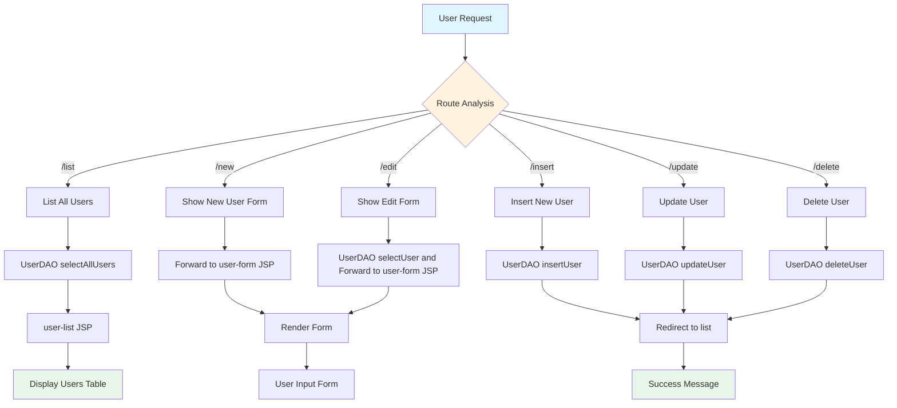

# CRUD Application with JSP, Servlet, and JDBC

A comprehensive web-based CRUD (Create, Read, Update, Delete) application built using JSP, Servlets, and JDBC for user management operations. This application demonstrates the classic Java web development stack with MySQL database integration.

## 🚀 Features

- **Create** new users with name, email, and country
- **Read** and display all users in a paginated table
- **Update** existing user information
- **Delete** users from the database
- Responsive web interface using Bootstrap
- RESTful URL patterns for user operations
- Error handling and validation

## 🏗️ Architecture

```
┌─────────────────┐    ┌─────────────────┐    ┌─────────────────┐    ┌─────────────────┐
│   Presentation  │    │    Controller   │    │    Service      │    │     Database    │
│      Layer      │    │     Layer       │    │     Layer       │    │     Layer       │
├─────────────────┤    ├─────────────────┤    ├─────────────────┤    ├─────────────────┤
│                 │    │                 │    │                 │    │                 │
│   JSP Pages     │◄──►│  UserServlet    │◄──►│    UserDAO      │◄──►│   MySQL DB      │
│                 │    │                 │    │                 │    │                 │
│ • index.jsp     │    │ • doGet()       │    │ • insertUser()  │    │   users table   │
│ • user-list.jsp │    │ • doPost()      │    │ • selectUser()  │    │                 │
│ • user-form.jsp │    │ • Route mapping │    │ • updateUser()  │    │                 │
│ • Error.jsp     │    │                 │    │ • deleteUser()  │    │                 │
│                 │    │                 │    │                 │    │                 │
└─────────────────┘    └─────────────────┘    └─────────────────┘    └─────────────────┘
```

## 🗂️ Project Structure

```
CRUD-With-Servlet-JSP-JDBC/
├── pom.xml                              # Maven configuration
├── mvnw                                 # Maven wrapper
├── mvnw.cmd                            # Maven wrapper (Windows)
└── src/
    └── main/
        ├── java/
        │   └── com/
        │       ├── crud/
        │       │   └── crudwithjspservletjdbc/
        │       │       └── HelloServlet.java        # Basic servlet example
        │       └── learn/
        │           └── servlet/
        │               └── usersm/
        │                   ├── DAO/
        │                   │   └── UserDAO.java     # Data Access Object
        │                   ├── model/
        │                   │   └── User.java        # User entity model
        │                   └── web/
        │                       └── UserServlet.java # Main controller
        └── webapp/
            ├── WEB-INF/
            │   └── web.xml                          # Web app configuration
            ├── Error.jsp                            # Error page
            ├── index.jsp                            # Landing page
            ├── user-form.jsp                        # Add/Edit user form
            └── user-list.jsp                        # Users listing page
```

## 🔄 Application Flow



## 📋 Database Schema

```sql
CREATE DATABASE servletcrud;
USE servletcrud;

CREATE TABLE users (
    id INT AUTO_INCREMENT PRIMARY KEY,
    name VARCHAR(100) NOT NULL,
    email VARCHAR(100) NOT NULL UNIQUE,
    country VARCHAR(50) NOT NULL
);
```

## 🛠️ Technology Stack

- **Backend**: Java Servlets, JSP (JavaServer Pages)
- **Database**: MySQL 8.0
- **Frontend**: HTML5, CSS3, Bootstrap 5.3.2
- **Build Tool**: Apache Maven
- **Template Engine**: JSTL (JavaServer Pages Standard Tag Library)
- **Database Connectivity**: JDBC
- **Server**: Apache Tomcat (or any servlet container)

## 📦 Dependencies

- **Jakarta Servlet API** 5.0.0 - For servlet functionality
- **Jakarta JSTL API** 3.0.0 - For JSP templating
- **MySQL Connector** 8.0.33 - For database connectivity
- **JUnit** 5.9.2 - For testing

## ⚙️ Setup and Installation

### Prerequisites

- Java 11 or higher
- MySQL 8.0 or higher
- Apache Tomcat 10.x or any Jakarta EE compatible server
- Maven 3.6+

### Installation Steps

1. **Clone the repository**

   ```bash
   git clone <repository-url>
   cd CRUD-With-Servlet-JSP-JDBC
   ```

2. **Setup MySQL Database**

   ```sql
   CREATE DATABASE servletcrud;
   USE servletcrud;

   CREATE TABLE users (
       id INT AUTO_INCREMENT PRIMARY KEY,
       name VARCHAR(100) NOT NULL,
       email VARCHAR(100) NOT NULL UNIQUE,
       country VARCHAR(50) NOT NULL
   );
   ```

3. **Configure Database Connection**
   Update the database credentials in `UserDAO.java`:

   ```java
   public static final String url = "jdbc:mysql://localhost:3306/servletcrud";
   public static final String username = "your-username";
   public static final String password = "your-password";
   ```

4. **Build the Project**

   ```bash
   ./mvnw clean compile package
   ```

5. **Deploy to Tomcat**
   - Copy the generated WAR file from `target/` to Tomcat's `webapps/` directory
   - Start Tomcat server
   - Access the application at `http://localhost:8080/CRUD-with-JSP-Servlet-JDBC-1.0-SNAPSHOT/`

## 🚀 Usage

### Main Operations

1. **View Users**: Navigate to `/list` to see all users
2. **Add User**: Click "Add New User" button or go to `/new`
3. **Edit User**: Click "Edit" link next to any user in the list
4. **Delete User**: Click "Delete" link next to any user in the list

### URL Patterns

- `GET /list` - Display all users
- `GET /new` - Show new user form
- `POST /insert` - Create new user
- `GET /edit?id={id}` - Show edit form for specific user
- `POST /update` - Update existing user
- `GET /delete?id={id}` - Delete specific user

## 🔧 Configuration Files

### web.xml

Configures servlet mappings and welcome files.

### pom.xml

Maven configuration with all necessary dependencies and build plugins.

## 🎨 User Interface

The application features a clean, responsive interface built with Bootstrap:

- **Navigation Bar**: Consistent header with branding and navigation
- **User List Table**: Responsive table showing all users with action buttons
- **User Form**: Clean form for adding/editing users
- **Error Handling**: Dedicated error page for graceful error handling

## 🧪 Testing

Run tests using Maven:

```bash
./mvnw test
```

## 📝 API Endpoints

| Method | Endpoint          | Description           |
| ------ | ----------------- | --------------------- |
| GET    | `/list`           | Get all users         |
| GET    | `/new`            | Show create user form |
| POST   | `/insert`         | Create new user       |
| GET    | `/edit?id={id}`   | Show edit user form   |
| POST   | `/update`         | Update existing user  |
| GET    | `/delete?id={id}` | Delete user           |

## 🤝 Contributing

1. Fork the repository
2. Create a feature branch (`git checkout -b feature/AmazingFeature`)
3. Commit your changes (`git commit -m 'Add some AmazingFeature'`)
4. Push to the branch (`git push origin feature/AmazingFeature`)
5. Open a Pull Request

## 📄 License

This project is open source and available under the [MIT License](LICENSE).

## 👥 Authors

- Masudur Rahman Sourav

## 🙏 Acknowledgments

- Bootstrap team for the UI framework
- Apache Tomcat community
- MySQL development team
- Jakarta EE community

---

**Note**: This is a demonstration project for learning purposes. For production use, consider implementing additional features like input validation, security measures, connection pooling, and proper error handling.
